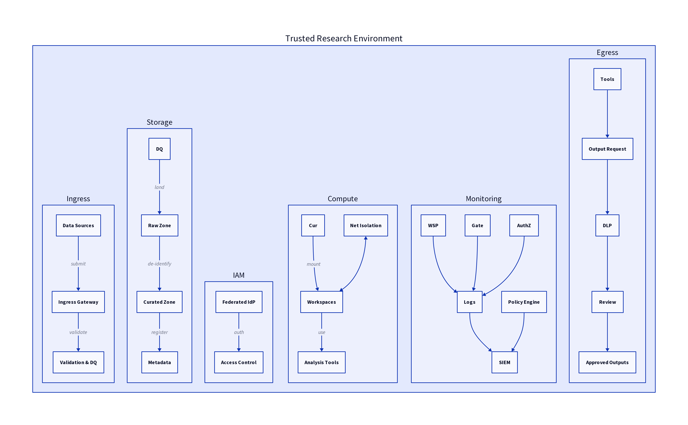

# Reference Architecture

## Diagram Legend

| Abbreviation      | Description                                                        |
|-------------------|--------------------------------------------------------------------|
| **AuthZ**         | Authorization service – enforces role- and attribute-based access   |
| **DLP**           | Data Loss Prevention engine – enforces data egress policies         |
| **DQ**            | Data Quality – validation and cleaning of incoming data             |
| **Egress**        | Controlled export of approved outputs after disclosure review       |
| **ETL**           | Extract, Transform, Load – data curation process                   |
| **IdP**           | Identity Provider – federated authentication source                |
| **NetIso**        | Network Isolation – prevents external network access               |
| **PHI**           | Protected Health Information – identifiable health data            |
| **RBAC / ABAC**   | Role-Based / Attribute-Based Access Control models                 |
| **SIEM**          | Security Information and Event Management – aggregates logs/alerts  |
| **WSP**           | Workspace – secure compute environment (VMs, containers, VDI)      |