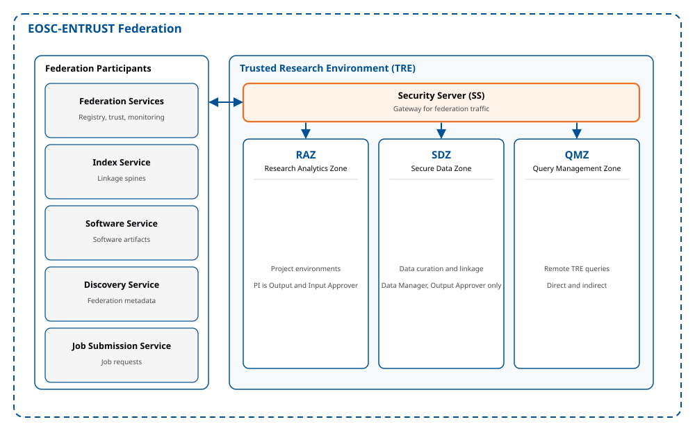

# Reference Architecture

*Figure: A Trusted Research Environment (TRE) within the EOSC-ENTRUST federation. Every Federation Participant routes traffic through a Security Server; inside a TRE, three functional zones (RAZ, SDZ, QMZ) separate analysis, data management, and query handling. For the full description of each element, see [Module 2: Architecture](../modules/architecture/index.md) and [Module 3: Interfaces](../modules/interfaces/index.md).*

## Diagram Legend

| Term | Description |
|---|---|
| **Security Server (SS)** | Gateway that every Federation Participant runs for all inter-participant traffic. |
| **RAZ** (Research Analytics Zone) | Where Project Members access approved data for analysis; the PI acts as Output and Input Approver. |
| **SDZ** (Secure Data Zone) | Manages, links, curates, ingresses, and egresses research-ready sensitive datasets; access limited to Data Manager and Output Approver roles. |
| **QMZ** (Query Management Zone) | Handles queries sent from remote TREs or external Job Submission services, direct or indirect. |
| **Federation Services** | Coordinating functions: Registry, Trust, Accounting, Management, and Monitoring. |
| **Index Service** | Creates linkage spines to join datasets across the federation. |
| **Software Service** | Provides approved environment and research software artifacts. |
| **Discovery Service** | Publishes federation metadata to users outside the federation. |
| **Job Submission Service** | Receives and forwards indirect query (job) requests. |