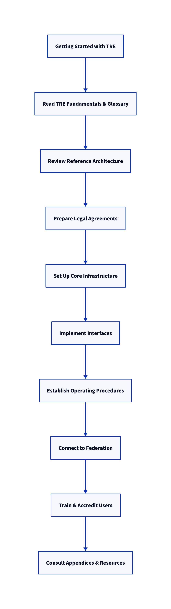

# Introduction

Welcome to the EOSC-ENTRUST Trusted Research Environment (TRE) Operators Training Material. This guide is designed to help you build, operate, and maintain secure, compliant, and interoperable TREs.

## Learning Objectives

- Understand TRE concepts and terminology
- Set up and configure TRE architecture
- Implement interfaces and operational procedures
- Apply legal and compliance requirements
- Integrate with federated TREs

## Getting Started Checklist

**Understand TRE Fundamentals**

   - Read the TRE Fundamentals section.
   - Review key terminology in the Glossary.

**Review Reference Architecture**

   - Study the architecture diagrams and component descriptions.

**Prepare Legal Agreements**

   - Download and adapt template legal agreements (DSA, DTA, DUA).

**Set Up Core Infrastructure**

   - Deploy Security Server.
   - Register with Federation Registry.
   - Configure Trust Services and AAAI.

**Implement Interfaces**

   - Integrate required APIs and data exchange protocols.

**Establish Operating Procedures**

   - Document operational tasks and maintenance routines.

**Connect to Federation**

   - Ensure compliance with federation requirements.
   - Test inter-TRE connectivity.

**Train and Accredit Users**

   - Verify researcher accreditation and training records.

**Consult Appendices**

   - Use reference materials and resources for troubleshooting and support.

*Figure: TRE Getting Started Flowchart*

## Modules

1. [TRE Fundamentals](#module-1-tre-fundamentals)
2. [Architecture & Setup](#module-2-architecture--setup)
3. [Interfaces & Configuration](#module-3-interfaces--configuration)
4. [Operations & Procedures](#module-4-operations--procedures)
5. [Legal & Compliance](#module-5-legal--compliance)
6. [Federation & Collaboration](#module-6-federation--collaboration)
7. [Appendices & Resources](#module-7-appendices--resources)

---

## Module 1: TRE Fundamentals
- Key concepts and terminology ([Glossary](appendices/glossary.md))
- Compliance basics ([TRE Fundamentals](fundamentals.md))

## Module 2: Architecture & Setup
- Zones and core components ([Architecture](modules/architecture/index.md))
- AAA integration

## Module 3: Interfaces & Configuration
- Interface definitions ([Interfaces](modules/interfaces/index.md))

## Module 4: Operations & Procedures
- Onboarding, monitoring, incident response ([Procedures](modules/procedures/index.md))

## Module 5: Legal & Compliance
- Agreements, certification, governance ([Legal](modules/legal/index.md))

## Module 6: Federation & Collaboration
- Federation integration ([Federation](federation.md))
- Data sharing and collaboration

## Module 7: Appendices & Resources
- [Glossary](appendices/glossary.md)
- [Reference Architecture](appendices/reference-architecture.md)
- [Resources](appendices/resources.md)

## Disclaimer

This site was partially generated and improved using GitHub Copilot. Specific tasks performed by Copilot include:

- Rewriting sections to use active voice for clarity and directness
- Formatting checklists for better compatibility with documentation tools
- Improving structure and readability of technical requirements

All content has been reviewed for accuracy and compliance with project standards.