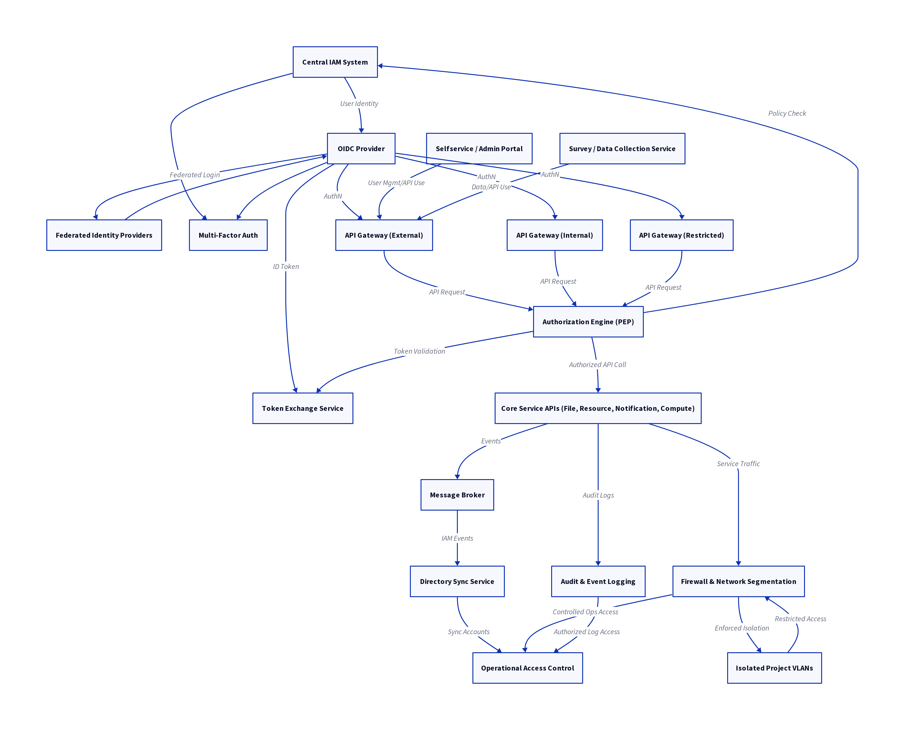

# Architecture Overview

This section introduces the infrastructure layer of the ENTRUST Blueprint, detailing the Participants and the minimal requirements for creating a trustworthy federation.

## Design Philosophy

The architecture follows the principle of **"start from where you are"** and proposes the **minimum necessary new infrastructure** required to connect TREs. It is explicitly a "back end" architecture; researchers interact only with TREs, not the Federation infrastructure directly.

## Federation Participants

Participants are the strategic capabilities forming the federation network.

### Federation Participants

- **Trusted Research Environment (TRE)**
    - *Function*: Primary vehicle for delivering sensitive data to researchers in a secure, controlled, and approved manner.
    - *Key Components*: Research Analytics Zone (RAZ), Secure Data Zone (SDZ), Query Management Zone (QMZ).

- **Index Service**
    - *Function*: Creates linkage spines to link distinct datasets at the individual level, enabling authorized joint datasets.
    - *Key Components*: Pseudonymization service, Linkage spines registry.

- **Software Service**
    - *Function*: Provides approved software artifacts, including environment configurations and research artifacts (workflows, containers).
    - *Key Components*: Environment Artifacts, Research Artifacts.

- **Discovery Service**
    - *Function*: Provides information (metadata) about features of the Federation to users outside the Federation, potentially querying the Registry.
    - *Key Components*: Output Control process.

- **Job Submission Service**
    - *Function*: Receives job requests (indirect queries) from researchers and manages forwarding and result handling.
    - *Key Components*: Job Approval process, Output Control process.

- **Federation Services**
    - *Function*: Provides coordinating functions: Registry, Trust, Accounting, Management, and Monitoring.
    - *Key Components*: AAAI Capability, Registry.

## Interoperability Requirement

The federation must maintain integrity, non-repudiation, and traceability. All Projects **MUST** be registered with the Federation's Registry services, and Project Identities **MUST** be globally recognizable and unique.

For the definition and core characteristics of a Trusted Research Environment (TRE), see [TRE Fundamentals](../../fundamentals.md).

## Zones

### TRE Functional Zones: RAZ, SDZ, and QMZ

The TRE model is divided into three functional zones, reflecting different governance and security contexts. A TRE may contain one or more of these zones.

#### Research Analytics Zone (RAZ)

The RAZ provides the environment for the **Project Member** to gain direct access to approved data for analysis.

*   **Mandatory Requirements:**
    *   An RAZ **MUST** have one or more **Project Environments**.
    *   If an RAZ supports Project Environments with remote data presentations, it **MUST** support the Query (direct) and incoming Response interface types.
*   **Key ENTRUST Modification:** The ENTRUST RAZ model includes the **Principal Investigator (PI)** acting as both the **Output Approver** and **Input Approver** for the project environment. This modification avoids infrastructure scalability bottlenecks and clarifies legal responsibility, particularly where the TRE is not the data controller.
*   **EHDS Alignment:** The RAZ is comparable to the European Health Data Space's (EHDS) **Secure Processing Environment (SPE)** concept.

#### Secure Data Zone (SDZ)

The SDZ supports the management, linkage, curation, ingress, and egress of research-ready sensitive datasets.

*   **Mandatory Requirements:**
    *   An SDZ **MUST** have a **Data Management function**.
    *   All data movements to or from the SDZ **MUST** pass through the Data Management function.
    *   **Data Manager** and **Output Approver** roles **SHALL** be granted access to the SDZ; all other roles **SHALL NOT** be granted access.
    *   The SDZ **SHOULD** support the Data Egress and Data Ingress interface types for sending and receiving Data Extract Objects.
*   **Specialized SDZ: Secure Data Archive (SDA):** The ENTRUST architecture includes the SDA as a specialized SDZ storing **published Curated Data** and handling Data Access Requests to such published data. Curated Data should have unique IDs and accompanying metadata to enable credit attributions.

#### Query Management Zone (QMZ)

The QMZ handles queries sent from other, remote TREs or external Job Submission services, typically sitting alongside an SDZ.

*   **Direct Queries:** A QMZ supporting direct queries **MUST** have an **External Presentation component** (e.g., a database view) and **MUST** support the incoming Query (direct) interface type.
*   **Indirect Queries:** A QMZ supporting indirect queries **MUST** include a **Job Controller component** and a **Job Executor component**. The Job Request **MUST** pass through a **Job Approval process**.
*   **HPC:** A QMZ **MAY** provide a **High-Performance Computing (HPC) component** to support the execution of indirect query jobs.

## TRE Architecture
For the architecture diagram and legend, see [Reference Architecture](../../appendices/reference-architecture.md).

## Generalized AAA Architecture in a TRE

This section presents a generalized architecture for Authentication, Authorization, and Auditing (AAA) integration within a TRE, derived from the design principles and implementation experience of the Services for Sensitive Data (TSD).

### Architectural Overview

*Figure: Conceptual model showing how authentication, authorization, and auditing components interact within a TRE.*

### Authentication

The authentication subsystem consists of several coordinated components. At its foundation, the central Identity and Access Management (IAM) system governs all user, project, and group identities, while also providing APIs for authentication, authorization, and resource management. Authentication operations are facilitated by an OpenID Connect (OIDC) provider, which implements standards-based authentication flows—including PKCE for browser clients—and integrates with external identity providers to support multi-institutional access. Federated authentication enables users to log in through trusted third-party providers, simplifying account creation and management processes. The environment enforces multi-factor authentication (MFA), such as time-based (TOTP) or HMAC-based (HOTP) one-time passcodes, which users can manage via self-service portal. Token exchange mechanisms support the issuance of narrowly scoped, short-lived API access tokens. For non-interactive or time-limited workflows, client and instance-based authentication—including “magic links”—enables automated or temporary access, with optional password protection for added security.

### Authorization

Authorization is centrally managed by a policy enforcement engine, which serves as the Policy Enforcement Point (PEP) for all API requests entering the environment through designated gateways. This engine evaluates each request against access control policies (grants) maintained within the IAM database. These policies may be static—maintained as code or configuration under version control—or dynamically managed via programmable interfaces provided by the IAM API. All access tokens and authorization grants are strictly scoped to specific projects or tenants and to designated API gateways. Network and resource-level isolation is maintained through private VLANs and firewall policies. The authorization workflow includes validating the token’s integrity and claims, matching access policy grants to requested API operations and contextual attributes, and enforcing any additional restrictions such as time windows or usage limits.

### Auditing

Auditing is implemented across all relevant system layers to support accountability, regulatory compliance, and operational monitoring. Every API operation—spanning file, data, and resource actions—is logged in detail, with audit logs accessible for both operational staff and authorized project administrators. Changes to IAM data and resource allocations are tracked, capturing all create, update, and delete events. All storage and file access operations are monitored for data integrity and incident response purposes. Exports of data and downloads from publication interfaces are recorded to maintain a verifiable trail of data egress. Finally, system event and operations logs are aggregated and made available for ongoing monitoring, security investigations, and incident response.

### Key Architectural Components and Integration Points

The environment employs multiple API gateways (external, internal, and restricted) to route all API traffic, enforce TLS, and delegate authentication and authorization to centralized control points. A message broker enables event-driven service integrations, publishing relevant events to subscribed internal and external consumers. Microservices synchronize user, group, and project information from the IAM system to external directories as needed. Core research, compute, storage, and notification APIs all integrate directly with the central IAM for authentication and authorization. Web-based self-service and administrative portals, as well as data collection services, interact with the AAA infrastructure for secure, auditable operations. Project-level network isolation is enforced via software-defined firewalls and VLAN segmentation, dynamically configured based on IAM and directory data. Staff operational access is tightly regulated by IAM-based role assignment, group membership, multi-factor authentication, and the use of bastion hosts; all privileged actions are auditable.