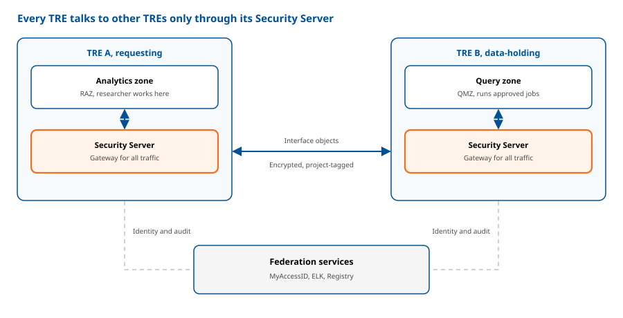
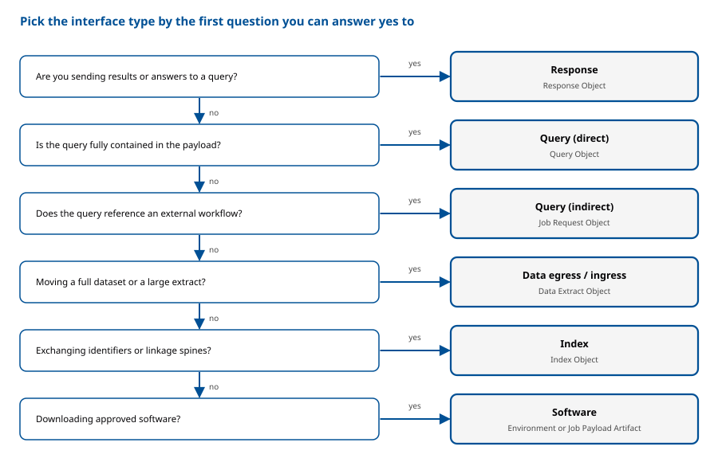

# Module 3: Interfaces and Configuration: A Practical Guide

<strong>Audience:</strong>TRE Builder

Module 3 covers the two things a TRE needs in order to take part in the federation: a way to exchange data and workflows, and a way to establish trust. Part A, data and workflow exchange interfaces, defines how TREs send and receive information as standardised Structured Data Objects packaged as Five Safes RO-Crates and tagged with their Project context. It covers six interface types (Query, Job, Data, Index, Software, and Response), each connecting only to its matching counterpart. All traffic is encrypted and routed through each Participant's Security Server. Part B, federated AAAI, defines how identity, access, and auditing work across TREs. It builds on an AARC-compliant infrastructure with MyAccessID as the central trust hub, using OIDC and OAuth 2.0 for authentication, Project-based membership for access, and central ELK-based auditing for accountability. Each TRE keeps full control of its own final authorisation decision. Together, the two halves let a Builder move data and jobs between TREs while knowing who is asking, what they may do, and what has happened. 

## Overview: How TREs Connect

Every TRE in the federation talks to other TREs only through its Security Server. Federation services provide identity (MyAccessID), auditing (ELK) and the registry. Objects move between the two Security Servers; both servers rely on the federation services for identity and auditing. 

## Part A: Data and Workflow Exchange Interfaces

### How Data Moves Between TREs

TREs exchange Structured Data Objects using well-defined interface types. Route all traffic to and from interface services through the Security Servers of the host Participant to ensure security and traceability. 

### Packaging Structured Data

Always package objects exchanged between Participants in a standard way:

- Use the Five Safes RO-Crate standard for all structured data objects.
- Tag each object with metadata that indicates the Project context for traceability. 

### Which Interface Do I Need?

Answer the questions in the decision flow below, starting from what you want to do. 

Work down the questions in order; the first yes tells you the interface type and the object you will exchange. 

| Interface type | Use when | Object exchanged | Connects only to |
| --- | --- | --- | --- |
| Query (Direct) | The query is fully contained in the payload (e.g. SQL) | Query Object | Query (Direct) services |
| Query (Indirect) | The query references an external executable artifact (e.g. a workflow URL) | Job Request Object | Query (Indirect) services |
| Data Ingress / Egress | Moving complete sensitive datasets or large extracts | Data Extract Object | Egress connects only to Ingress |
| Index | Exchanging lists of personal or depersonalised identifiers and master linkage spines | Index Object | Index services |
| Software | Downloading approved software artifacts from a Software Service | Environment or Job Payload Artifact | Software services |
| Response | Sending results or answers to queries | Response Object | Response services |

### Security Rules That Apply to Every Interface

- Route all interface traffic through Security Servers. 
- Encrypt all data exchanges between Participants (data extracts, direct and indirect queries, and index data). 
- Tag all objects with project metadata for traceability. 
- Only Data Manager roles can invoke interfaces that expose sensitive metadata or data extracts. 

## Part B: Federated AAAI

Federated AAAI provides a secure, consistent approach to identity, access, and auditing across multiple TREs. Users authenticate through the configured identity federation and receive access according to project membership and the TRE's authorisation rules. Users do not configure AAAI services. 

### Core Federation Requirements

- All EOSC Nodes, including TRE Providers, must:
    - **Architecture**: run an AAAI infrastructure compliant with the AARC Blueprint.
    - **Federation model**: use a hub-and-spoke model with MyAccessID as the central hub for trust and identity services.
    - **Protocols**: support OpenID Connect (OIDC) and OAuth 2.0.
    - **Federation membership**: join eduGAIN as a Service Provider, submit technical metadata, and meet security requirements.
    - **Authentication**: enforce multi-factor authentication (MFA) for access to secure services.
- Identity, collaboration, and claims:
    - **Project identity**: assign a globally unique Project ID and grant access through membership in that project.
    - **Attribute exchange**: use the AARC Blueprint model (AARC-G069) to express user roles and project membership across organisations.
    - **Cross-node use**: when a user presents an access token from Node X to a service in Node Y, Node Y uses MyAccessID for token introspection.
    - **Researcher certification**: track user training and certification as a "Researcher Passport" to support the "Safe People" principle.
    - **Transparency**: publish a web page listing supported collaborations or projects, including URNs, status, and jurisdiction.
- Cross-TRE authorisation:
    - Each TRE keeps full control over its final authorisation decision.
    - Use the Project as the unit defining access scope: members, datasets, duration.
    - Use OIDC UserInfo or OAuth 2.0 Token Introspection for general questions (for example, "Is this user a member of Project X?").
    - For fine-grained rules, exchange request attributes (subject, object, action, environment) as JSON over REST APIs, define policies in ODRL or REGO, provide policy bundles as .tar.gz archives, and aggregate policies with Open Policy Agent (OPA) before deciding.
- Auditing and accounting:
    - Use a central ELK Stack (Elasticsearch, Logstash, Kibana) as the federation's auditing and accounting service. TREs may also run local ELK instances.
    - Submit all accounting data through an ELK-compatible API.
    - TREs and federation services must send audit logs to the central ELK stack.
    - Use the standard audit model to answer who, what, when, and where during audits.

### Worked Example: Running a Workflow on Data Held in Another TRE

A researcher in TRE A wants to run an analysis workflow on a dataset held in TRE B. The query references an external workflow (a URL), so it uses the Query (Indirect) interface and exchanges a Job Request Object. 

1. The researcher is authenticated. The researcher logs in to TRE A through the identity federation and passes MFA. Their access is tied to a registered Project with a globally unique Project ID, and their role and project membership are expressed as AARC-G069 claims.
2. TRE A builds the Job Request Object. The job request is packaged as a Five Safes RO-Crate and tagged with the Project context.
3. The request leaves TRE A through its Security Server. The object is encrypted and sent to the Query (Indirect) service of TRE B.
4. TRE B checks who is asking. It validates the user's access token through MyAccessID token introspection.
5. TRE B makes its own authorisation decision. It evaluates the request attributes against its policies using Open Policy Agent, combining federation-level and local rules.
6. The job is approved and run. The request goes through the Job Approval process in TRE B's Query Management Zone, and the Job Executor runs the workflow next to the data.
7. Results are checked and returned. Results go through Output Control, are packaged as a Response Object, and are returned through TRE B's Security Server to TRE A, encrypted and project-tagged.
8. Everything is audited. Both TREs and the federation services send audit logs to the central ELK stack.

To be confirmed with the authors: when the workflow is fetched (step 6) and exactly where Output Control applies (step 7). 

## Builder Checklist

- [ ] AAAI infrastructure compliant with the AARC Blueprint
- [ ] OIDC and OAuth 2.0 supported
- [ ] Joined eduGAIN as a Service Provider
- [ ] MFA enforced for secure services
- [ ] Globally unique Project IDs assigned
- [ ] Security Server in place for all interface traffic
- [ ] Required interfaces implemented and encrypted
- [ ] Audit logs sent to the central ELK stack
- [ ] Web page published listing supported collaborations and projects

## Key Standards at a Glance

| Standard or tool | What it is used for |
| --- | --- |
| Five Safes RO-Crate | Packaging structured data objects |
| AARC Blueprint and AARC-G069 | Federated AAI architecture and role/membership claims |
| MyAccessID | Central trust and identity hub |
| eduGAIN | Identity federation membership |
| OIDC and OAuth 2.0 | Authentication and token-based access |
| ODRL and REGO | Policy languages for fine-grained authorisation |
| Open Policy Agent (OPA) | Aggregating policies and making the decision |
| ELK Stack | Central auditing and accounting |